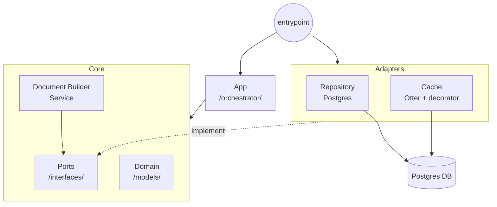
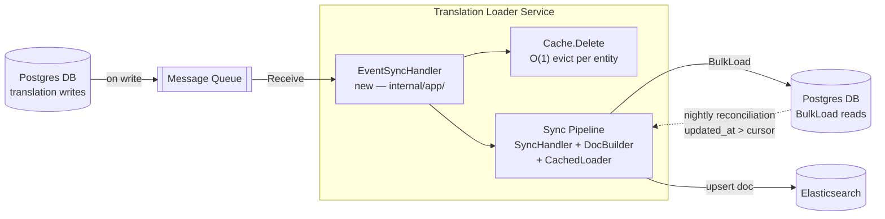

# Translation Loader

A Go service that assembles Elasticsearch documents from product and translation data stored in Postgres. Built with a lite hexagonal architecture for maintainability and the Otter caching library for high-speed, concurrent translation access.

## How to Run

### Prerequisites
- Go 1.23+
- Docker & Docker Compose

### Setup & Infrastructure
1. Start the required infrastructure (PostgreSQL):
   ```bash
   make docker-up
   ```

2. Run database migrations:
   ```bash
   make migrate
   ```

3. Load data fixtures:
   ```bash
   make load-fixtures
   ```

4. Run the application:
   ```bash
   # Ensure DATABASE_URL is set if using non-default configuration
   make run ARGS="--products 00000000-0000-0000-0000-000000000001,00000000-0000-0000-0000-000000000002 -locales=th,en"
   ```

### Environment Variables

| Variable | Default | Description |
|---|---|---|
| `DATABASE_URL` | required | PostgreSQL DSN |
| `CACHE_DRIVER` | `otter` | Cache backend (`otter` only) |
| `CACHE_TTL` | `5m` | Cache TTL (Go duration string) |
| `CACHE_OTTER_CAPACITY` | `1000` | Max items for Otter driver |

### Development Commands

```bash
make test-unit          # Unit tests only (no Docker required)
make test-integration   # Integration tests (spins up Postgres via testcontainers)
make test               # All tests
make lint               # golangci-lint
make generate-mocks     # Regenerate mocks from port interfaces
```

---

## Design Decisions

### Lite Hexagonal Architecture

The service follows a simplified hexagonal (ports-and-adapters) architecture. All business logic lives in `internal/core/` and depends only on interfaces defined in `internal/core/ports/`. External concerns — Postgres, caching — are implemented in `internal/adapters/` and injected at startup in `cmd/sync/main.go`.

This means every core component (`DocumentBuilder`, `SyncHandler`) can be unit-tested with mocks, and adapters can be swapped without touching business logic. Mocks are generated via `make generate-mocks` from the port interfaces.



### Single Bulk Translation Round-Trip

`DocumentBuilder.BuildProductDocument` collects all entity IDs it will need (product, attributes, specifications) before making any query, then calls `TranslationLoader.BulkLoad` once with the full set. There is no N+1 — translations for an entire product document are fetched in a single `SELECT ... WHERE entity_id = ANY($1) AND locale = ANY($2)`.

### Concurrent Product Data Fetching

`SyncHandler.SyncProduct` fetches the product, its attributes, and its specifications in parallel using `errgroup`. All three Postgres queries run concurrently; the handler waits for all three before passing data to `DocumentBuilder`. This keeps per-sync latency proportional to the slowest single query rather than their sum.

### Entity-Centric Cache with Singleflight Guard

Translations are cached by entity ID. The `CacheDriver` interface exposes a `Load(key, ttl, loaderFunc)` pattern — the adapter (Otter) serialises cache-miss fetches under a per-key `singleflight.Group`, so concurrent requests for the same entity trigger exactly one DB round-trip.

A generation counter (`delGen`) in the Otter driver prevents a race where a `Delete` fires between a loader returning and the value being written to cache. If the generation has advanced, the stale value is discarded. This is exercised explicitly in `TestOtterDriver_NoStaleWriteAfterDelete`.

### Partial Locale-Hit Eviction

The `CachedTranslationLoader` checks that every requested locale is present in a cached entry. If a locale is missing (e.g. a new locale was added after the entry was cached), the entry is evicted and a fresh full load is performed. This keeps the cache locale-complete without requiring a TTL flush.

### English as Mandatory Fallback

`DocumentBuilder.prepareLocales` always injects `"en"` into the locale list before calling `BulkLoad`, even if the caller did not request it. English is used as the fallback for every field when a requested locale has no translation. This guarantees no field is ever empty in the assembled document.

### Graceful Missing-Translation Fallbacks

Rather than returning errors for absent translations, the builder falls back at each field:
- Product name → SKU
- Brand label → raw brand code from the product row
- Attribute value → raw spec value

Errors are reserved for infrastructure failures (DB unreachable, scan failure), not for missing data.

---

## What I Would Change Given More Time

### Fix Per-Entity DB Queries on Cache Miss

The most significant correctness gap: `CachedTranslationLoader.BulkLoad` loops over entity IDs and calls `underlying.BulkLoad` with a single entity ID per iteration on a cache miss. Ten uncached entities produce ten separate DB queries. The fix is to collect all cache-miss IDs first, issue one `BulkLoad` for the entire miss set, then populate the cache per entity from the single result. This preserves the bulk contract the port promises.

### Add `Invalidate` to the Port Interface

`CachedTranslationLoader.Invalidate` is a method on the concrete type only, not on the `TranslationLoader` interface. Callers must hold the concrete type to call it, which leaks the adapter into application code. The cleaner shape is a dedicated `TranslationInvalidator` interface (or a method on `CacheDriver`) so the app layer depends only on abstractions.

### Fix the Double-Wrap Error in `GetProduct`

`fmt.Errorf("product %s: %w: %w", id, domain.ErrNotFound, err)` wraps two sentinel errors simultaneously. This makes both `errors.Is(err, domain.ErrNotFound)` and `errors.Is(err, pgx.ErrNoRows)` true, which could cause unintended matches in calling code. The intent should be expressed as a single sentinel with the original error as the cause.

### Make `Invalidate` Accept a Context

`CachedTranslationLoader.Invalidate` calls `context.Background()` internally instead of accepting a `ctx` parameter. This makes it impossible for callers to propagate cancellation or deadlines through invalidation, and makes the method harder to test.

### Consistent Locale Handling in `populateAttributes`

`populateAttributes` fetches spec value labels using hardcoded `"en"` — `getTranslation(translations[s.ID], "value_label", "en")` — while `oil_grade` gets full locale-aware treatment. All attributes should use the same locale-aware lookup with English fallback for consistency.

### Extract the Duplicated Loader Closure

The loader closure in `CachedTranslationLoader.BulkLoad` (lines 31–43) is copy-pasted verbatim for the partial-hit reload path (lines 62–74). This should be a named helper function.

### Remove or Fix the Non-Compiling Test

`TestDocumentBuilder_ThirdLocale_InLabel` contains a comment stating it "fails to compile" and is left in the codebase. A failing test in a submission is misleading. It should either be fixed or removed and tracked as a known gap.

### Observability

Add structured logging (zerolog or slog) at the top layer, and expose Prometheus metrics for cache hit/miss ratio, BulkLoad latency, and sync duration per product. These are the first signals needed to operate the service in production.

---

## Design Questions

### 1. Delta Sync

> How would you extend this loader to support delta sync — only reloading translations that have been updated since a given cursor timestamp?

#### Architecture



#### Approach

Rather than polling the database with a cursor timestamp, the preferred approach is **event-driven**: whenever a translation is written, a change event carrying the affected entity ID is published to a message queue. A new event handler in the app layer consumes these events in near-real time. For each event it evicts the entity from the cache and hands off to the existing sync pipeline — which calls the unchanged `BulkLoad` for that entity and rebuilds its document. No new method is needed on the `TranslationLoader` port; only a new driven port (`EventSource`) and its adapter are introduced. The rest of the hexagon — `SyncHandler`, `DocumentBuilder`, `CachedTranslationLoader` — is untouched.

A cursor-based full-reload sweep (`WHERE updated_at > last_run`) still runs as a **nightly reconciliation backstop** to recover any events missed during a publisher outage.

---

### 2. Query Strategy

> What SQL or query strategy would you use, and what is the main trade-off?

On the hot path there is **no new query**: the queue delivers the exact set of entity IDs that changed, so the handler issues the existing `BulkLoad` targeted at those IDs only — already selective by design. This keeps database load proportional to the number of changed entities, not the total size of the translations table.

The reconciliation sweep is the only place a timestamp predicate is needed. It adds a single filter — `AND updated_at > $cursor` — to the existing translation query, with the cursor advancing to `MAX(updated_at)` at the end of each successful run. A composite index on `(entity_id, updated_at)` satisfies both the existing `entity_id` filter and the new timestamp bound in one index scan, avoiding a full table scan as the dataset grows.

**Trade-off:** the cursor relies on clock monotonicity at the database layer. A replica that drifts slightly behind the committed cursor, or two writes landing within the same timestamp tick, can cause rows to be silently skipped. This is a permanent correctness gap — unlike cache staleness which self-heals at TTL expiry — and requires the reconciliation job to be treated as a first-class, monitored requirement rather than an afterthought.
