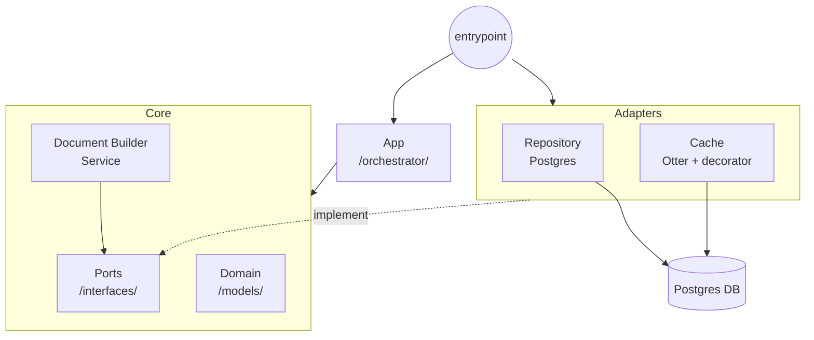
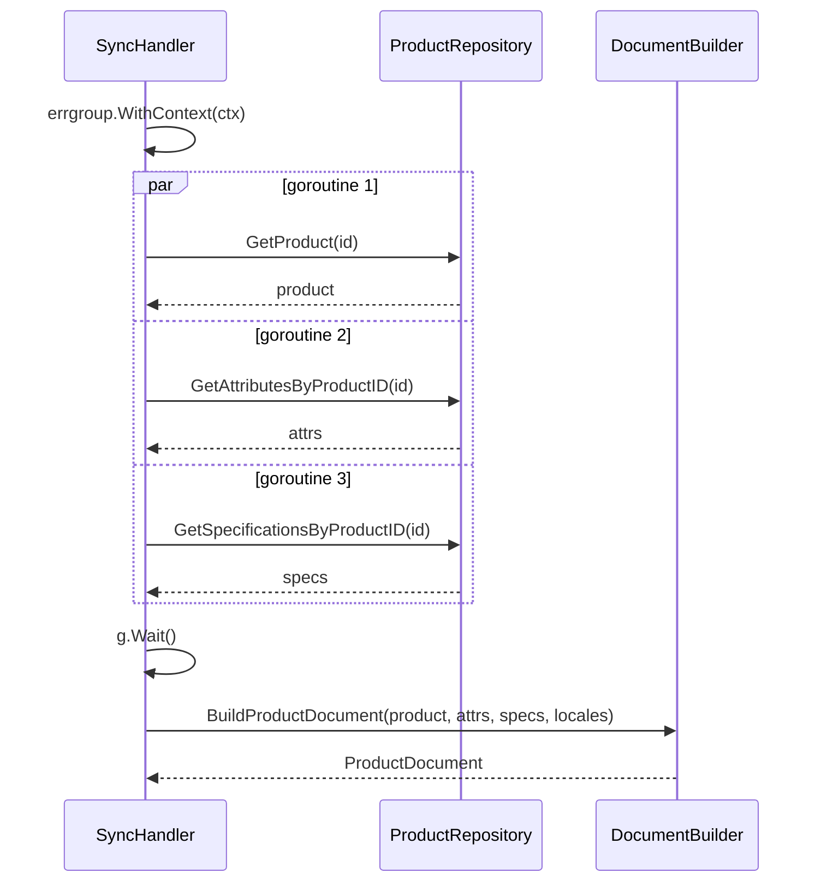
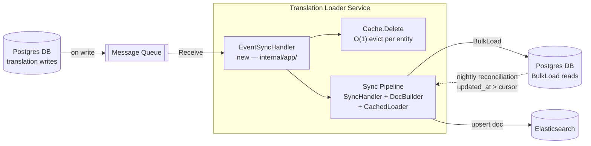

# Translation Loader

A Go service that assembles Elasticsearch documents from product and translation data stored in Postgres. Built with a lite hexagonal architecture for maintainability and the Otter caching library for high-speed, concurrent translation access.

## How to Run

### Prerequisites
- Go 1.23+
- Docker & Docker Compose

### Setup & Infrastructure
1. Start the required infrastructure (PostgreSQL):
   ```bash
   make docker-up
   ```

2. Run database migrations:
   ```bash
   make migrate
   ```

3. Load data fixtures:
   ```bash
   make load-fixtures
   ```

4. Run the application:
   ```bash
   # Ensure DATABASE_URL is set if using non-default configuration
   make run ARGS="--products 00000000-0000-0000-0000-000000000001,00000000-0000-0000-0000-000000000002 -locales=th,en"
   ```

### Environment Variables

| Variable | Default | Description |
|---|---|---|
| `DATABASE_URL` | required | PostgreSQL DSN |
| `CACHE_DRIVER` | `otter` | Cache backend (`otter` only) |
| `CACHE_TTL` | `5m` | Cache TTL (Go duration string) |
| `CACHE_OTTER_CAPACITY` | `1000` | Max items for Otter driver |

### Development Commands

```bash
make test-unit          # Unit tests only (no Docker required)
make test-integration   # Integration tests (spins up Postgres via testcontainers)
make test               # All tests
make lint               # golangci-lint
make generate-mocks     # Regenerate mocks from port interfaces
```

---

## Design Decisions

### Lite Hexagonal Architecture

The service follows a simplified hexagonal (ports-and-adapters) architecture. All business logic lives in `internal/core/` and depends only on interfaces defined in `internal/core/ports/`. External concerns — Postgres, caching — are implemented in `internal/adapters/` and injected at startup in `cmd/sync/main.go`.

This means every core component (`DocumentBuilder`, `SyncHandler`) can be unit-tested with mocks, and adapters can be swapped without touching business logic. Mocks are generated via `make generate-mocks` from the port interfaces.



### Otter Caching Library

Otter was selected as the cache driver due to its superior performance characteristics under high concurrency. Unlike standard `sync.Map` or mutex-protected caches, Otter leverages a lock-free design and cache-friendly data structures to minimize contention. Its high-throughput and low-latency profile make it uniquely suited for the translation-loading hot path, ensuring that translation lookups do not become a bottleneck during peak load.

### Single Bulk Translation Round-Trip

`DocumentBuilder.BuildProductDocument` collects all entity IDs it will need (product, attributes, specifications) before making any query, then calls `TranslationLoader.BulkLoad` once with the full set. There is no N+1 — translations for an entire product document are fetched in a single `SELECT ... WHERE entity_id = ANY($1) AND locale = ANY($2)`.

### Concurrent Product Data Fetching

`SyncHandler.SyncProduct` fetches the product, its attributes, and its specifications in parallel using `errgroup`. All three Postgres queries run concurrently; the handler waits for all three before passing data to `DocumentBuilder`. This keeps per-sync latency proportional to the slowest single query rather than their sum.



### Graceful Missing-Translation Fallbacks

Rather than returning errors for absent translations, the builder falls back at each field:
- Product name → SKU
- Brand label → raw brand code from the product row
- Attribute value → raw spec value

Errors are reserved for infrastructure failures (DB unreachable, scan failure), not for missing data.

---

## What I Would Change Given More Time
-  **Fix Per-Entity DB Queries on Cache Miss**:The most significant correctness gap: `CachedTranslationLoader.BulkLoad` loops over entity IDs and calls `underlying.BulkLoad` with a single entity ID per iteration on a cache miss. Ten uncached entities produce ten separate DB queries. The fix is to collect all cache-miss IDs first, issue one `BulkLoad` for the entire miss set, then populate the cache per entity from the single result. This preserves the bulk contract the port promises.

- **Consistent Locale Handling**: Here `oil_grade` gets full locale-aware treatment. All attributes should use the same locale-aware lookup with English fallback for consistency.

-  **Observability**: Add structured logging (zerolog or slog) at the top layer, and expose Prometheus metrics for cache hit/miss ratio, BulkLoad latency, and sync duration per product. These are the first signals needed to operate the service in production.

---

## Design Questions

### 1. Delta Sync

> How would you extend this loader to support delta sync — only reloading translations that have been updated since a given cursor timestamp?

#### Architecture



#### Approach

Rather than polling the database with a cursor timestamp, the preferred approach is **event-driven**: whenever a translation is written, a change event carrying the affected entity ID is published to a message queue. A new event handler in the app layer consumes these events in near-real time. For each event it evicts the entity from the cache and hands off to the existing sync pipeline — which calls the unchanged `BulkLoad` for that entity and rebuilds its document. No new method is needed on the `TranslationLoader` port; only a new driven port (`EventSource`) and its adapter are introduced. The rest of the hexagon — `SyncHandler`, `DocumentBuilder`, `CachedTranslationLoader` — is untouched.

A cursor-based full-reload sweep (`WHERE updated_at > last_run`) still runs as a **nightly reconciliation backstop** to recover any events missed during a publisher outage.

---

### 2. Query Strategy

> What SQL or query strategy would you use, and what is the main trade-off?

- **Hot Path**: Leverages existing `BulkLoad` with queue-provided entity IDs. Database load is proportional only to the number of changed entities, avoiding table scans.
- **Reconciliation**: Uses `AND updated_at > $cursor` on the existing query. A composite index on `(entity_id, updated_at)` ensures efficient index scans, keeping performance stable as the dataset grows.
- **Main Trade-off**: Dependency on clock monotonicity at the DB layer. Potential for skipped rows due to clock drift or racing writes within the same timestamp, requiring the reconciliation job to be monitored as a critical process.
